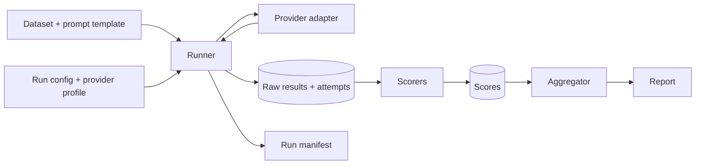

# Architecture

**Mostly planned design.** M0 (repository foundations) is complete, and M1.1 is implemented: the generation schemas and the provider contract, described under "Provider contract" below. The runner, storage, manifests, scorers, evaluation engine and all provider adapters are not implemented yet, and `providers` and `scorers` are still empty packages.

## Components

- **Core engine** (`niriksha.core`): runner, provider protocol (request and result types), storage, run manifests. Never imports a concrete provider.
- **Scorers** (`niriksha.scorers`): pure functions over stored outputs. Each carries a version.
- **Provider adapters** (`niriksha.providers`): implement the provider protocol. The first will be a deterministic fake provider. Real providers (an OpenAI-compatible HTTP adapter, for cloud and local runtimes) come later and are opt-in.
- **Data and configuration**: versioned datasets (immutable cases, content-hash version) and provider/run profiles as data files in `datasets/` and `configs/`. Profiles hold environment variable names, never secret values.
- **Outputs**: raw results, per-attempt records, run manifest, scores, and reports.

## Data flow

## Generation is separate from scoring

Calling a model costs money or time and is not exactly repeatable. Scoring is cheap and deterministic. The runner therefore persists raw model outputs, every attempt and its outcome before any scoring happens. Scorers read only stored data, so a scorer bug fix or a new metric re-runs offline with no new inference calls.

## Design rules

- Failures are recorded as typed outcomes. A failed model or evaluator is never silently substituted.
- Every attempt, including retries, is stored.
- A request needing a capability the provider has not declared fails loudly; parameters are not silently dropped.
- Benchmark cases are immutable. A correction creates a new dataset version with a changelog entry.
- No network access by default.

## Provider contract (implemented in M1.1)

Implemented: `niriksha.core.generation` (request, params, usage, success and failure types) and `niriksha.core.provider` (the `Provider` protocol). Not yet implemented: any concrete provider, the runner, the store, and provider profiles.

- `Provider.generate(request)` is synchronous and makes exactly one attempt. It never retries; the runner owns retries and attempt records.
- Expected provider and transport problems are returned as `GenerationFailure` with one of seven kinds (`timeout`, `rate_limit`, `server_error`, `malformed_response`, `invalid_request`, `unsupported_capability`, `internal_error`). Programming errors are not converted into failures; they raise.
- An invalid request raises `pydantic.ValidationError` at construction, so it can never become a recorded attempt.
- Results carry no timing and no cost. The runner times each call (M1.2) and records it in its attempt record. Cost is derived later from usage and a dated price table. Unknown usage stays `None`.
- Provider metadata is flat and JSON-safe, and keys that look secret-bearing are rejected. Raw provider payloads are not captured yet.
- A test enforces that `niriksha.core` imports no providers, scorers or networking libraries.

Details and rationale: [ADR 0002](adr/0002-provider-contract.md).
