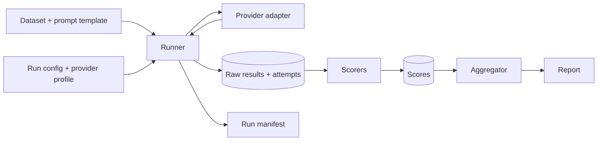

# Architecture

**Mostly planned design.** M0 (repository foundations) is complete. M1.1 (generation schemas and provider contract) and M1.2 (a deterministic fake provider and a minimal sequential runner) are implemented, described under "Provider contract" and "Runner and fake provider" below. Storage, manifests, dataset loading, retries, scorers, the evaluation engine and all real provider adapters are not implemented yet, and `scorers` is still an empty package.

## Components

- **Core engine** (`niriksha.core`): runner, provider protocol (request and result types), storage, run manifests. Never imports a concrete provider.
- **Scorers** (`niriksha.scorers`): pure functions over stored outputs. Each carries a version.
- **Provider adapters** (`niriksha.providers`): implement the provider protocol. The first is a deterministic fake provider (implemented in M1.2). Real providers (an OpenAI-compatible HTTP adapter, for cloud and local runtimes) come later and are opt-in.
- **Data and configuration**: versioned datasets (immutable cases, content-hash version) and provider/run profiles as data files in `datasets/` and `configs/`. Profiles hold environment variable names, never secret values.
- **Outputs**: raw results, per-attempt records, run manifest, scores, and reports.

## Data flow

## Generation is separate from scoring

Calling a model costs money or time and is not exactly repeatable. Scoring is cheap and deterministic. The runner therefore persists raw model outputs, every attempt and its outcome before any scoring happens. Scorers read only stored data, so a scorer bug fix or a new metric re-runs offline with no new inference calls.

## Design rules

- Failures are recorded as typed outcomes. A failed model or evaluator is never silently substituted.
- Every attempt, including retries, is stored.
- A request needing a capability the provider has not declared fails loudly; parameters are not silently dropped.
- Benchmark cases are immutable. A correction creates a new dataset version with a changelog entry.
- No network access by default.

## Provider contract (implemented in M1.1)

Implemented: `niriksha.core.generation` (request, params, usage, success and failure types) and `niriksha.core.provider` (the `Provider` protocol). Not yet implemented at M1.1: any concrete provider, the runner, the store, and provider profiles (the fake provider and runner arrived in M1.2, below).

- `Provider.generate(request)` is synchronous and makes exactly one attempt. It never retries; the runner owns retries and attempt records.
- Expected provider and transport problems are returned as `GenerationFailure` with one of seven kinds (`timeout`, `rate_limit`, `server_error`, `malformed_response`, `invalid_request`, `unsupported_capability`, `internal_error`). Programming errors are not converted into failures; they raise.
- An invalid request raises `pydantic.ValidationError` at construction, so it can never become a recorded attempt.
- Results carry no timing and no cost. The runner times each call and records it in a separate execution record (M1.2, below). Cost is derived later from usage and a dated price table. Unknown usage stays `None`.
- Provider metadata is flat and JSON-safe, and keys that look secret-bearing are rejected. Raw provider payloads are not captured yet.
- A test enforces that `niriksha.core` imports no providers, scorers or networking libraries.

Details and rationale: [ADR 0002](adr/0002-provider-contract.md).

## Runner and fake provider (implemented in M1.2)

Implemented: `niriksha.core.runner` (`run_requests`, `ExecutionRecord`, `ProviderContractViolation`) and `niriksha.providers.fake` (`FakeProvider`). Offline only: no network, no model, no persistence.

- `run_requests(provider, requests, *, clock=time.perf_counter)` calls `provider.generate` exactly once per request, sequentially, and returns one `ExecutionRecord` per request in input order. It does not retry, run concurrently, or persist anything.
- `ExecutionRecord` holds the `GenerationResult` and `elapsed_s`. Timing lives in the runner, not in the schemas or providers, so every provider is measured the same way with a monotonic clock around `generate()`. A provider's self-reported timing would not be comparable, and the fake provider's would be scripted. The clock is injectable so tests are deterministic.
- A result whose `request_id`, `requested_model` or `provider` does not match the request and provider, or that is not a `GenerationSuccess` or `GenerationFailure`, raises `ProviderContractViolation`. It is a provider bug, not a model outcome, so it is neither recorded as a failure nor corrected.
- Any other exception from a provider propagates unchanged. Expected provider failures arrive as `GenerationFailure` values and are kept in the records.
- Nothing is persisted yet, so an exception partway through a run discards the records collected so far. Storage, manifests and resume are M1.3.
- `FakeProvider(script=None, *, name="fake", returned_model="fake-model-v0")` echoes the last user message, or replays a script (`str` for output text, a `FailureKind` for a failure) in call order. Running past the end of the script raises. It records every request in `calls`, never reports usage, and marks results with `provider_metadata={"fake": True}`. It is a test double, not an inference service.
