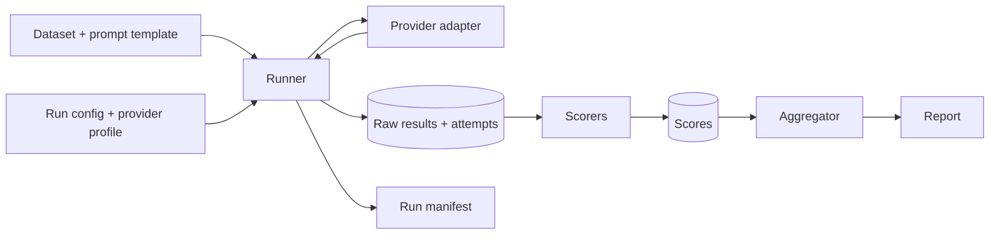

# Architecture

**Planned design. Nothing below is implemented yet**; the only code in the repository is empty package skeletons (`core`, `providers`, `scorers`).

## Components

- **Core engine** (`niriksha.core`): runner, provider protocol (request and result types), storage, run manifests. Never imports a concrete provider.
- **Scorers** (`niriksha.scorers`): pure functions over stored outputs. Each carries a version.
- **Provider adapters** (`niriksha.providers`): implement the provider protocol. The first will be a deterministic fake provider. Real providers (an OpenAI-compatible HTTP adapter, for cloud and local runtimes) come later and are opt-in.
- **Data and configuration**: versioned datasets (immutable cases, content-hash version) and provider/run profiles as data files in `datasets/` and `configs/`. Profiles hold environment variable names, never secret values.
- **Outputs**: raw results, per-attempt records, run manifest, scores, and reports.

## Data flow

## Generation is separate from scoring

Calling a model costs money or time and is not exactly repeatable. Scoring is cheap and deterministic. The runner therefore persists raw model outputs, every attempt and its outcome before any scoring happens. Scorers read only stored data, so a scorer bug fix or a new metric re-runs offline with no new inference calls.

## Design rules

- Failures are recorded as typed outcomes. A failed model or evaluator is never silently substituted.
- Every attempt, including retries, is stored.
- A request needing a capability the provider has not declared fails loudly; parameters are not silently dropped.
- Benchmark cases are immutable. A correction creates a new dataset version with a changelog entry.
- No network access by default.
