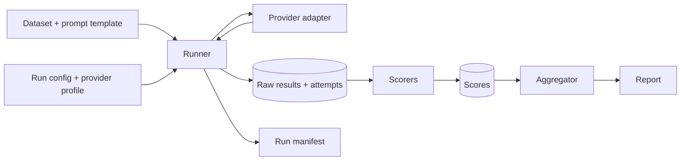

# Architecture

**Mostly planned design.** M0 (repository foundations) is complete. M1.1 (generation schemas and provider contract), M1.2 (a deterministic fake provider and a minimal sequential runner) and M1.3 (local dataset loading and hashing, provenance, run persistence and resume) are implemented, described under "Provider contract", "Runner and fake provider" and "Datasets and runs" below. Everything runs offline against the fake provider. M2.1 adds an offline run reader and three deterministic scorers, described under "Run reader and scorers" below. Score persistence, aggregation, JSON Schema validity, any CLI or config-file loading, retries, real provider adapters and the benchmark dataset are not implemented yet.

## Components

- **Core engine** (`niriksha.core`): runner, provider protocol (request and result types), dataset loading and hashing, run storage and manifests. Never imports a concrete provider.
- **Scorers** (`niriksha.scorers`): pure functions over stored outputs. Each carries a version.
- **Provider adapters** (`niriksha.providers`): implement the provider protocol. The first is a deterministic fake provider (implemented in M1.2). Real providers (an OpenAI-compatible HTTP adapter, for cloud and local runtimes) come later and are opt-in.
- **Data and configuration**: versioned datasets (immutable cases, content-hash identity; loading implemented in M1.3) and provider/run profiles as data files in `datasets/` and `configs/` (profiles and config loading are not implemented; run settings are a Python `RunConfig` for now). Profiles will hold environment variable names, never secret values.
- **Outputs**: raw results, per-attempt records, run manifest, scores, and reports.

## Data flow



## Generation is separate from scoring

Calling a model costs money or time and is not exactly repeatable. Scoring is cheap and deterministic. The runner therefore persists raw model outputs, every attempt and its outcome before any scoring happens. Scorers read only stored data, so a scorer bug fix or a new metric re-runs offline with no new inference calls.

## Design rules

- Failures are recorded as typed outcomes. A failed model or evaluator is never silently substituted.
- Every attempt, including retries, is stored.
- A request needing a capability the provider has not declared fails loudly; parameters are not silently dropped.
- Benchmark cases are immutable. A correction creates a new dataset version with a changelog entry.
- No network access by default.

## Provider contract (implemented in M1.1)

Implemented: `niriksha.core.generation` (request, params, usage, success and failure types) and `niriksha.core.provider` (the `Provider` protocol). Not yet implemented at M1.1: any concrete provider, the runner, the store, and provider profiles (the fake provider and runner arrived in M1.2, below).

- `Provider.generate(request)` is synchronous and makes exactly one attempt. It never retries; the runner owns retries and attempt records.
- Expected provider and transport problems are returned as `GenerationFailure` with one of seven kinds (`timeout`, `rate_limit`, `server_error`, `malformed_response`, `invalid_request`, `unsupported_capability`, `internal_error`). Programming errors are not converted into failures; they raise.
- An invalid request raises `pydantic.ValidationError` at construction, so it can never become a recorded attempt.
- Results carry no timing and no cost. The runner times each call and records it in a separate execution record (M1.2, below). Cost is derived later from usage and a dated price table. Unknown usage stays `None`.
- Provider metadata is flat and JSON-safe, and keys that look secret-bearing are rejected. Raw provider payloads are not captured yet.
- A test enforces that `niriksha.core` imports no providers, scorers or networking libraries.

Details and rationale: [ADR 0002](adr/0002-provider-contract.md).

## Runner and fake provider (implemented in M1.2)

Implemented: `niriksha.core.runner` (`run_requests`, `ExecutionRecord`, `ProviderContractViolation`) and `niriksha.providers.fake` (`FakeProvider`). Offline only: no network, no model, no persistence.

- `run_requests(provider, requests, *, clock=time.perf_counter)` calls `provider.generate` exactly once per request, sequentially, and returns one `ExecutionRecord` per request in input order. It does not retry, run concurrently, or persist anything.
- `ExecutionRecord` holds the `GenerationResult` and `elapsed_s`. Timing lives in the runner, not in the schemas or providers, so every provider is measured the same way with a monotonic clock around `generate()`. A provider's self-reported timing would not be comparable, and the fake provider's would be scripted. The clock is injectable so tests are deterministic.
- A result whose `request_id`, `requested_model` or `provider` does not match the request and provider, or that is not a `GenerationSuccess` or `GenerationFailure`, raises `ProviderContractViolation`. It is a provider bug, not a model outcome, so it is neither recorded as a failure nor corrected.
- Any other exception from a provider propagates unchanged. Expected provider failures arrive as `GenerationFailure` values and are kept in the records.
- Nothing is persisted yet, so an exception partway through a run discards the records collected so far. Storage, manifests and resume are M1.3.
- `FakeProvider(script=None, *, name="fake", returned_model="fake-model-v0")` echoes the last user message, or replays a script (`str` for output text, a `FailureKind` for a failure) in call order. Running past the end of the script raises. It records every request in `calls`, never reports usage, and marks results with `provider_metadata={"fake": True}`. It is a test double, not an inference service.

## Datasets and runs (implemented in M1.3)

Implemented: `niriksha.core.dataset`, `provenance`, `runstore` and `execution`. Offline only: no network, no real provider, no scoring, no CLI. The benchmark dataset itself does not exist yet; the datasets in `tests/fixtures/` are synthetic test data.

**Dataset directory** (local files only): `dataset.json` (metadata and the pinned `content_sha256`) and `cases.jsonl` (one case per line, file order is dataset order). Tasks are `short_answer_qa` and `json_extraction`. Loading is strict and rejects malformed or non-NFC input with file, line and field. The hash covers the parsed cases, task, output schema and hash/schema versions, and ignores formatting and descriptive metadata. The loader recomputes it and refuses a mismatch, so changing a case means bumping `version`, updating the pin and recording the change in the dataset card. Exact payload and rules: [ADR 0003](adr/0003-dataset-identity-and-run-persistence.md).

**Run directory** (`runs/<run_id>/`, gitignored):

```
manifest.json   written once, never modified: dataset identity, selection, prompt, provider, model,
                parameters, software versions, git commit (null when unknown)
results.jsonl   append-only: request_id, request hash, recorded_at, and the runner's ExecutionRecord
```

- `execute_run` builds and validates every request first, claims the run directory exclusively (an existing run is never overwritten), writes the manifest, then calls the provider once per case through `run_one` and appends each result, flushed and fsynced.
- Each result is revalidated at the persistence boundary before it is written, which catches data mutated after construction. An optional guard refuses results, and the manifest, containing caller-supplied secret values; it is a backstop, not a secret detector. A failed append is truncated away (best effort) and an append onto an incomplete final line is refused, so a torn tail is never merged into a corrupt line.
- `resume_run` refuses unless the dataset, selection, prompt, provider, model, parameters and software versions match the manifest. It runs only the selected cases that have no result, never retries recorded failures, truncates an unterminated final line, and treats other corruption, duplicates, unknown IDs request-hash mismatches, and stored results from a different provider or model as errors.
- Known limits: a call in flight when the process died can be issued again on resume (a duplicate billable call with a real provider); one writer at a time, no locking; directory-entry durability varies by platform. The manifest is a provenance record, not a guarantee of reproducibility.

## Run reader and scorers (implemented in M2.1)

Implemented: `niriksha.core.runload` (`load_run`, `LoadedRun`, `RunIntegrityError`), `niriksha.core.scoring` (`ScoreRecord`, `ScoreStatus`) and `niriksha.scorers` (`score_run` and three scorers). Offline and read-only: no provider, no network, no file written. Rationale and limits: [ADR 0004](adr/0004-run-integrity-and-scoring-contract.md).

- `load_run(run_dir, dataset_dir)` verifies a persisted run against its dataset and manifest (dataset identity and pin, selection, prompt hash, rebuilt request hashes, completeness, order, provider and model) and returns aligned cases, requests and results, or raises `RunIntegrityError`. It never repairs a file; a torn final line is refused until `resume_run` repairs it. It uses the production hash helpers, so it detects drift and tampering but cannot detect a defect in those helpers, and it does not authenticate the files.
- `score_run(loaded_run)` returns one `ScoreRecord` per applicable metric per request. A failed generation is `not_scored` with a reason, never dropped and never counted as wrong; unparsable or wrong output is a scored 0.0.
- Metrics (version 0.1.0 each): `normalized_exact_match` for short-answer QA, `json_parse_validity` and `field_exact_match` for JSON extraction. Definitions, normalisation rules, limits and examples: [normalized_exact_match](metrics/normalized_exact_match.md), [json_parse_validity](metrics/json_parse_validity.md), [field_exact_match](metrics/field_exact_match.md). They measure only what those documents define and are not validated against human labels.
- Scores are not persisted and there is no aggregation yet, so no run-level number exists.
